# AURA

**An AI-native digital audio workstation, built by AI agents — with a real-time Rust
engine, local AI music models, and an embedded MCP server so AI agents can *play* it too.**

<!-- Recorded from the real app: Claude driving AURA over MCP end-to-end. -->
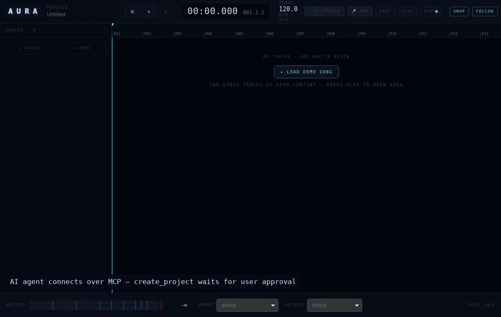

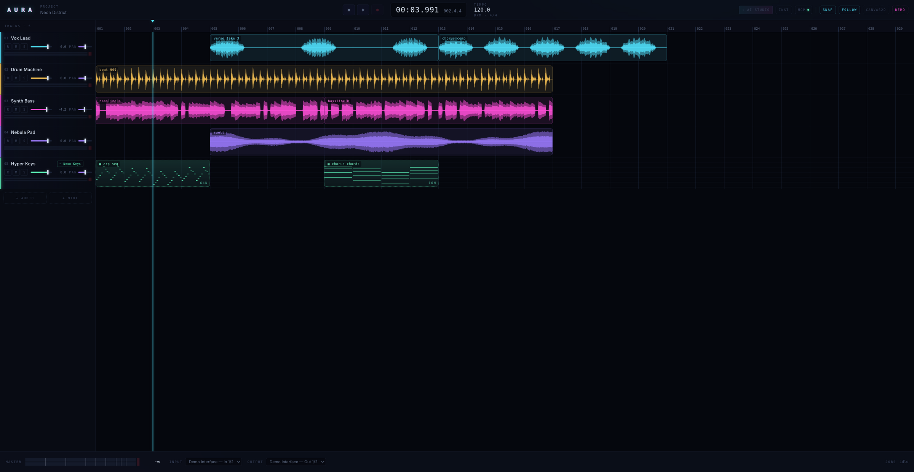

AURA is a working vertical slice of an FL Studio-class DAW: a native
**Tauri v2 + Svelte 5** app around a lock-free real-time audio engine in Rust,
with local AI models (stem separation, music generation, MIDI infilling,
hum-to-melody) wired in as sidecar processes, and a policy-gated **MCP server**
embedded in the app so LLM agents can inspect, mix, record and generate in the
open session.

The code was written by orchestrated Claude agents working in parallel
ownership zones against a frozen, schema-defined IPC surface — with an
architect role paying down flagged debt between rounds and an independent
adversarial review pass. The process and the boundaries are documented, not
hidden: see [docs/ARCHITECTURE.md](docs/ARCHITECTURE.md) (start with §0,
"Agent ownership boundaries") and the debt register in
[docs/SCALABILITY.md](docs/SCALABILITY.md).

---

## Feature tour

### Real-time audio engine

cpal-based playback with **no allocation, no locks, and no syscalls in the audio
callback** (the rules are binding — [ARCHITECTURE §2](docs/ARCHITECTURE.md)):
lock-free SPSC rings, RCU snapshot swaps for the mix graph, per-track gain/pan,
sample-accurate transport, multitrack recording to WAV, and peak/RMS meters
streamed to the UI at ~60 Hz.

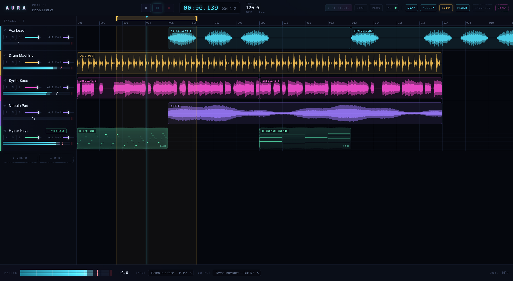

A **loop region** (draggable pins in the ruler + LOOP toggle) is persisted with
the project; voices release cleanly on every wrap. The master strip meters the
mix bus:


Playback **stops when the material ends** (STOP@END chip; ignored while
looping or recording). The boundary is detected in the audio callback, which
reports it and takes no action — the control plane decides what to do and
parks the playhead exactly on the boundary sample. That seam is meant to
carry punch-in/out and markers too:
[ARCHITECTURE §2.6](docs/ARCHITECTURE.md).

### Transport and timeline shortcuts

| Key | Does |
|---|---|
| `Space` | Play / pause |
| `Home` / `End` | Jump to start / to the end of the material |
| `←` / `→` | Move the playhead one **bar**, landing on the grid line |
| `Shift` + `←` / `→` | Same, one **beat** |
| `,` / `.` | Jump to the previous / next **clip edge**, across all tracks |
| `+` / `-` | Zoom the timeline |
| `S` | Toggle grid snap · `G` toggles AI Studio |
| `Ctrl/Cmd` + `+` / `-` / `0` | Interface zoom in / out / reset (whole UI, 80–200%; remembered across restarts) |

The ⏮ button jumps to the start without stopping; ■ stops and returns there.
Drag the ruler to seek, shift+wheel (or a horizontal wheel) to pan.

### MIDI, piano roll and tick-based musical time

A tick timeline with a tempo map (tick↔sample bijection), MIDI clips audible
through built-in instruments, `.mid` import/export, and a piano roll with
velocity editing, grid snap, and region infilling by Stanford's **Anticipatory
Music Transformer** (select a region, INFILL fills it in context).

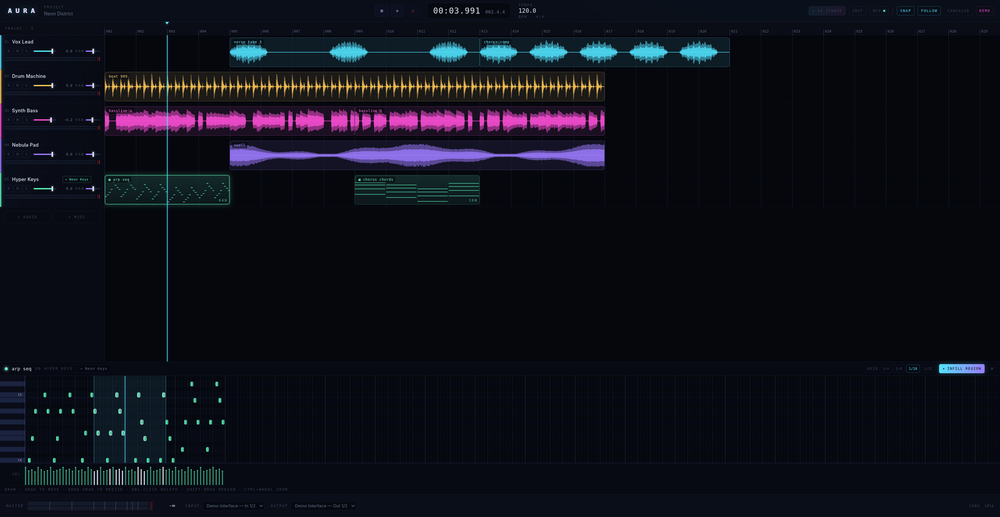

Notes flash at the moment they sound during playback (FLASH toggle):

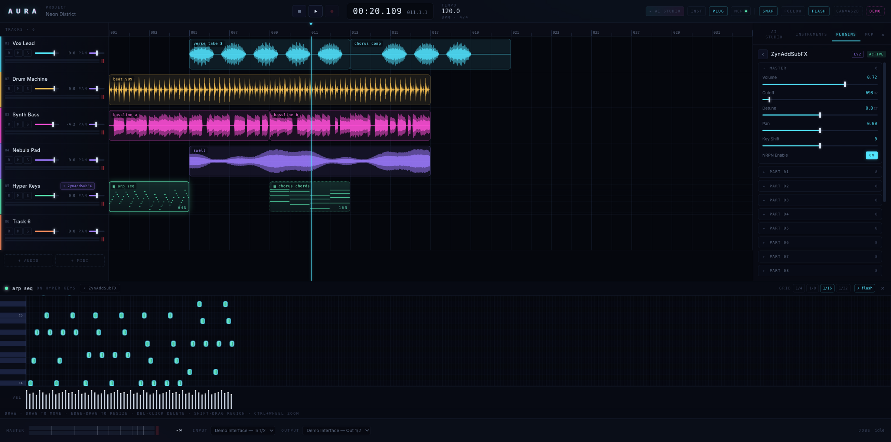

### Hardware MIDI in and out

Plug in a keyboard, pick the port in the master strip, arm a MIDI track and
play its instrument — then record what you play as one clip and one undo
step ([docs/midi-input.md](docs/midi-input.md)). Outward, AURA sends MIDI
clock plus Start/Stop/Continue/SPP (Hydrogen and friends slave to it) and
can play one MIDI track's notes through an external synth
([docs/midi-output.md](docs/midi-output.md)).

### The Composer — write music with theory you do not know yet

A piano roll is a grid of 128 equal keys, and music theory's whole claim is
that they are **not** equal: at any moment, given a key and a chord, some notes
are the chord, some are safe colour, some are tension that has to resolve, and
one or two are actively wrong. So AURA has a **harmony document** — one
`tick → (key, chord)` map in the core, under the op log, next to the tempo map
— and every surface reads it.

The **COMPOSER** panel (dock tab, `O`) is the editor for it. The circle of
fifths is not a diagram: a key's seven diatonic chords are a *contiguous arc*
on it, so the arc is lit and coloured by function (tonic / predominant /
dominant), the slots outside it are the borrowed chords, labelled with the
numeral they would be, and a click appends a chord. The progression strip
names every chord's Roman numeral; a ranked **NEXT** row suggests what comes
after it, with the reasoning spelled out rather than a score alone.

**GENERATE** writes parts as ordinary MIDI clips — chords, bass, melody and
drums, in **one** transaction, so one Ctrl+Z removes the whole idea:

- **Progressions** from eleven named schemas (the axis, doo-wop, the royal
  road, Pachelbel, ii–V–I, the 12-bar blues, the Andalusian cadence…), written
  once as Roman numerals so they transpose into any key — or a walk around the
  circle of fifths, or a weighted **functional grammar** (tonic departs,
  predominant prepares, dominant resolves) with a cadence nailed to the end.
- **Chords** voice-led by a dynamic-programming pass over the whole
  progression, not chord by chord: the voices move as little as possible and
  tendency tones resolve (the ♭7 of `V7` falls a semitone to the 3rd of `I`).
  Close / drop-2 / shell / spread.
- **Melody** as a motif and its **development** — repetition, sequence,
  inversion, augmentation, fragmentation — with chord tones on strong beats, no
  avoid notes, no leap over an octave, and a phrase that *ends* rather than
  stops (the antecedent unresolved, the consequent on a stable tone approached
  by step).
- **Drums from metrical theory**, not a pattern library: Bjorklund/Euclidean
  onset distribution (`E(3,8)` is the tresillo), a backbeat *derived* from the
  metre so 3/4 and 6/8 work with no special case, a syncopation dial whose
  effect is **measured** (Longuet-Higgins & Lee), velocities from the same
  metrical weight function every other part uses, and fills at phrase
  boundaries. A genre is six numbers, so it can be explained and tweaked.

And the **piano roll teaches**: its key rows are tinted by what each note does
over the chord at that point — banded per chord region, because the answer
changes with the chord — with the one note that fights the chord struck
through. The chip in the roll header names the chord in force (`♪ Cmaj7 · I`).

Everything the Composer makes carries a sentence saying **why**: not "V7" but
"the dominant — B rises to C and F falls to E, resolving inward". Generation is
seeded and deterministic, so a take you liked comes back; the generators are
pure functions in `src-tauri/src/theory/` with no I/O and no hidden state.
Product doc and roadmap: [`docs/backlog/composer-assistant.md`](docs/backlog/composer-assistant.md).

### Pitch Coach — sing against a MIDI melody

Pick a MIDI track as the reference and the bottom panel becomes a lane: the
target notes scroll under the playhead with your pitch drawn as a live trail,
detected in Rust (YIN, off the real-time callback) with no Web Audio
anywhere. With no melody selected it is a tuner whose headline number is how
*steadily* you are holding a note, not how close you are to one — steadiness
improves while accuracy is still poor, so it is the number that shows
progress. Record a take and it is scored note by note: signed cents, whether
you sang the note at all, entry timing, drift and vibrato
([docs/pitch-coach.md](docs/pitch-coach.md)).

Wear headphones — a backing track coming out of the speakers gets detected
as your pitch.

### Plugin hosting — CLAP + LV2 instruments

Real in-graph hosting of third-party instruments on MIDI tracks, with one shared
plugin main thread serving both formats. **ZynAddSubFX is verified
end-to-end** — the acceptance test renders a note headlessly and pitch-checks
the output at 440 Hz. CLAP bundles are scanned by a **sacrificial subprocess**,
so a bad `.clap` can't take AURA down.

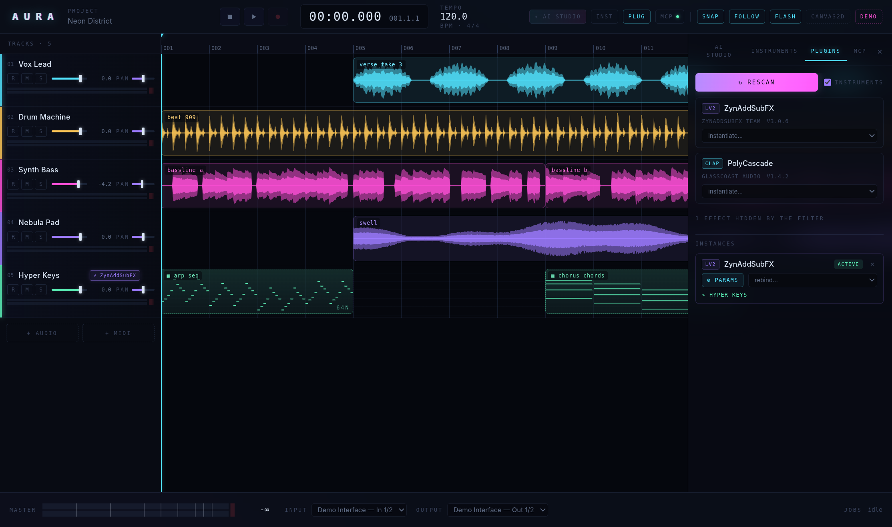

Every instrument gets a generic parameter panel, and plugin state (opaque patch
blobs, e.g. Zyn patches) is saved with the project and restored on open, with a
param-snapshot fallback for stateless-API plugins:

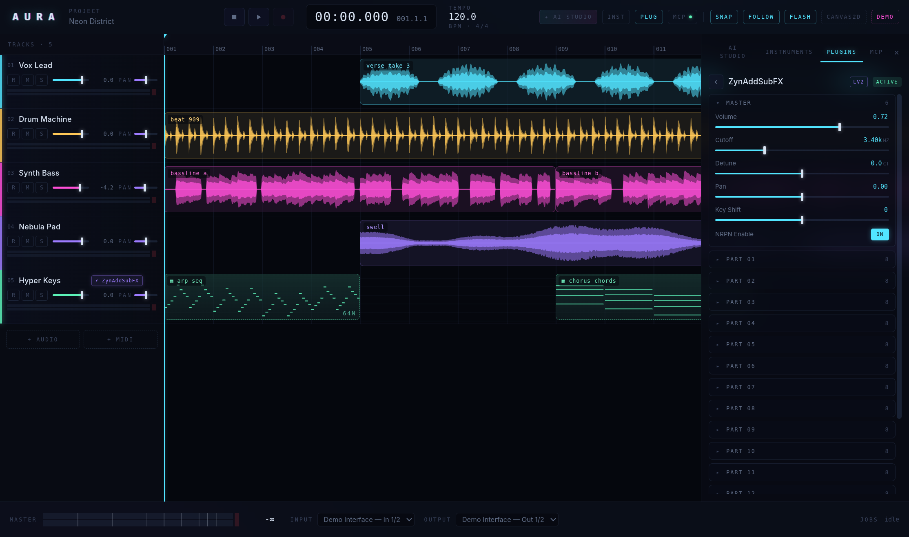

Zyn's factory banks are browsable directly — loading a patch re-binds the track
so the new sound reaches the engine:

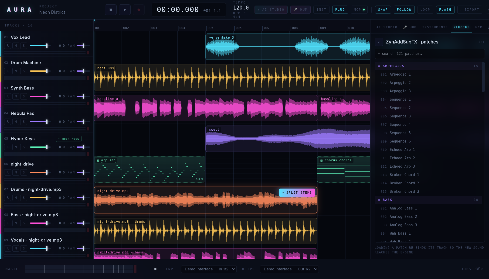

See the [synth compatibility sweep](docs/synth-compatibility.md) for how the
other synths fared (summary [below](#synth-compatibility)).

### AI Studio — generative music

Text→music via local **ACE-Step** (generate / repaint / audio-to-audio) and
cloud **ElevenLabs Music**; MIDI region infilling via **AMT**; text→SFZ
instrument via **Stable Audio Open**. Finished jobs can auto-import straight
onto the timeline.

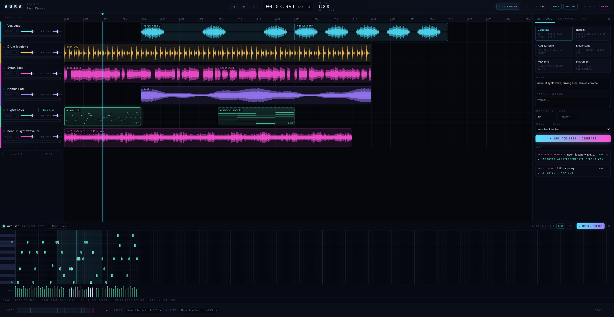

### Hum-to-song

Sing or hum into the mic; a pitch tracker turns it into a MIDI melody clip on a
new track (librosa-backed when the sidecar venv is present, pure-Python
fallback otherwise), with an optional generated accompaniment:

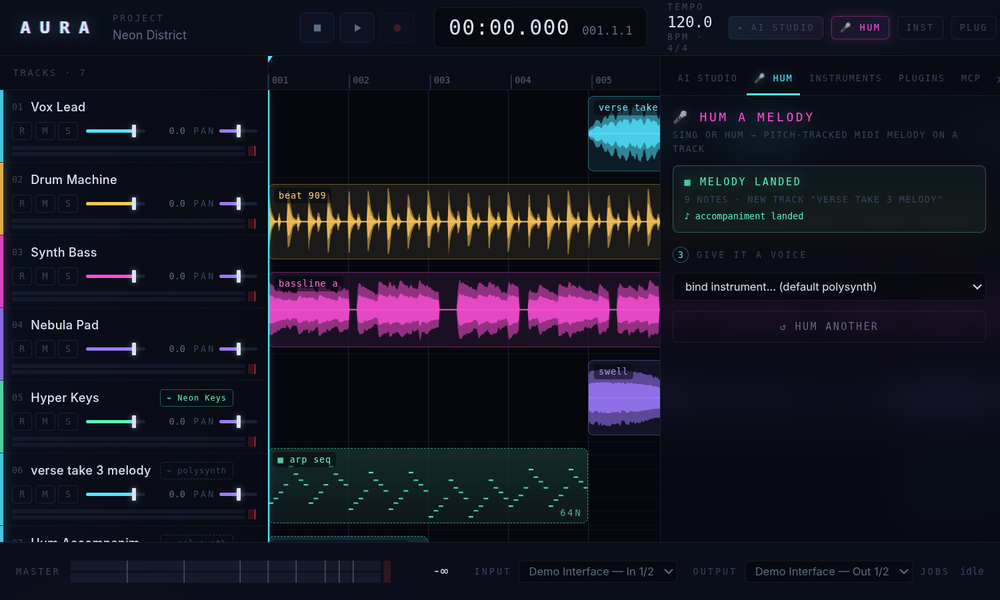

### Universal import + stem separation

Drop any audio file (wav/mp3/flac/ogg/aac/m4a) on the timeline — the left zone
imports it to a new track, the right zone imports **and splits it into stems**
with Demucs:

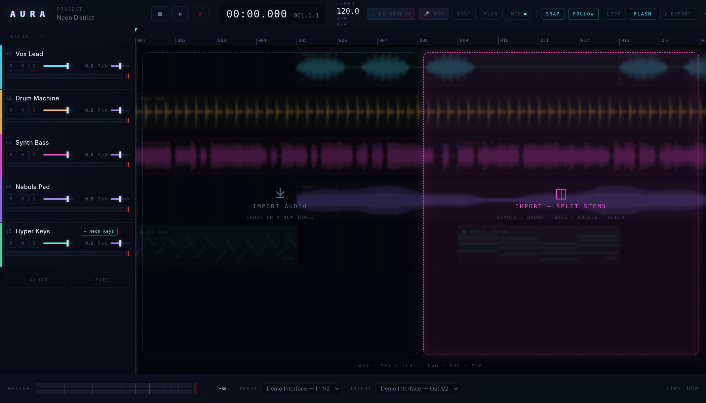

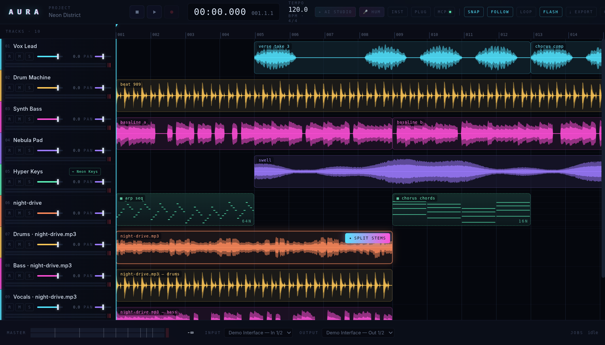

### AI loop-jam

With a loop region active, **EVOLVE** has ACE-Step repaint the looped audio;
the new generation swaps in seamlessly at the next wrap:

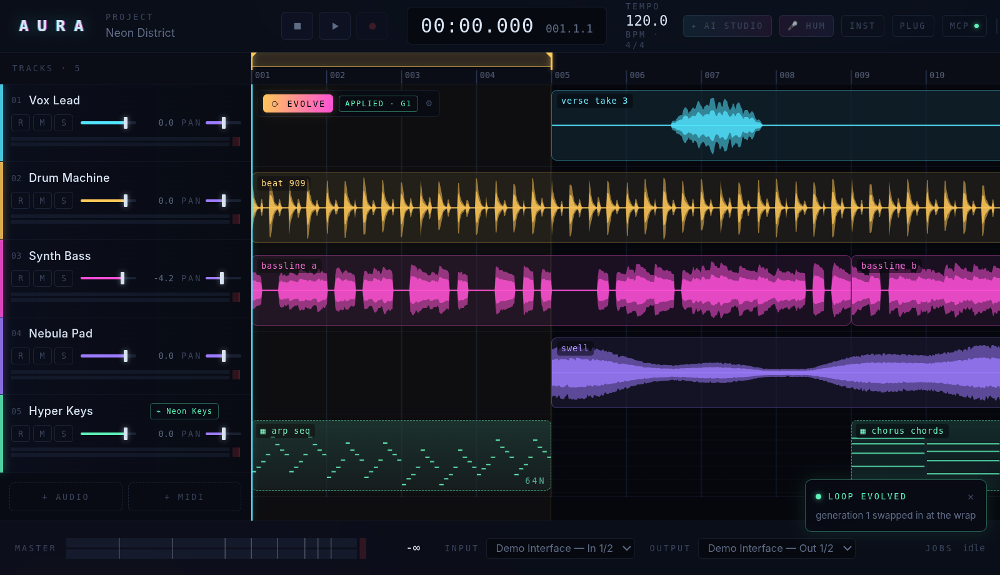

### SFZ sampler + AI instrument builder

An RT-safe 64-voice SFZ-subset sampler plays instruments on MIDI tracks;
**Stable Audio Open** builds whole multisampled instruments from a text prompt
and registers them in the browser on completion:

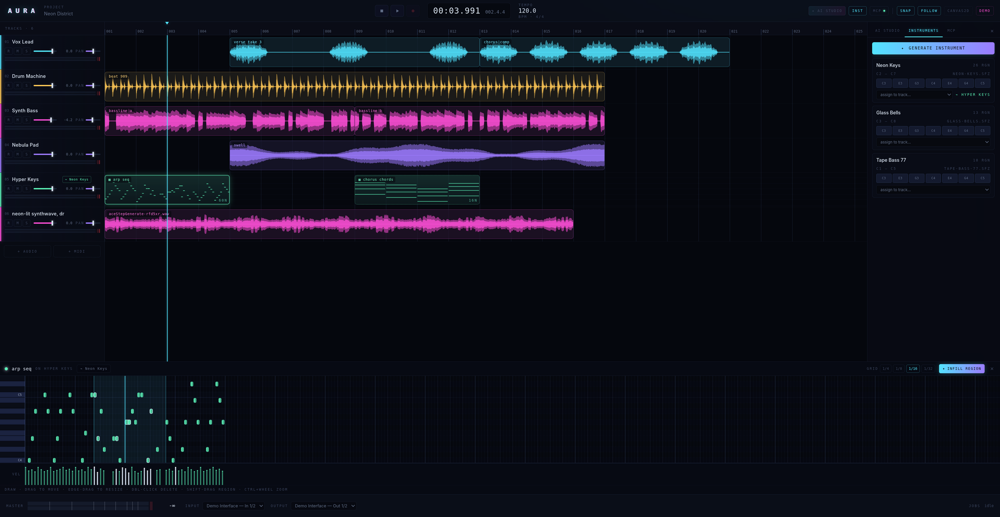

### Library & browser panel

The **LIB** dock tab browses three roots: **SAMPLES** (the default AURA
library folder plus any folders added under Preferences → LIBRARY; click a file
to audition it without touching the project), **CLIPS** (the open project's
audio and MIDI clips), and **PRESETS** (loaded sampler instruments and
ZynAddSubFX bank patches). Drag any row onto a track and it lands through the
ordinary import/clip-add commands — so every drop is a normal, undoable edit.
Directory listing and decoding happen in the Rust backend (`library_scan`,
`library_audition`); the panel is chrome.

### MCP — agents operate the DAW

An embedded MCP streamable-HTTP server on `127.0.0.1:41717` lets Claude Code,
Claude Desktop, or any MCP client inspect the project, read the meters, mix,
record and generate in the running session — token-authenticated, loopback-only,
and **policy-gated**:

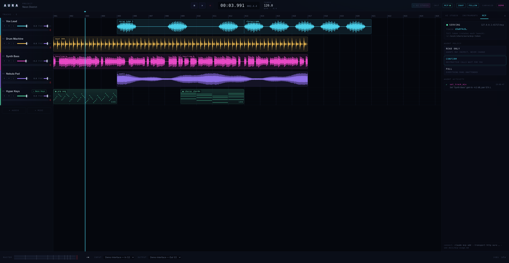

In the default `confirmDestructive` policy, every destructive call parks until
you approve it in the UI (60 s timeout ⇒ deny):

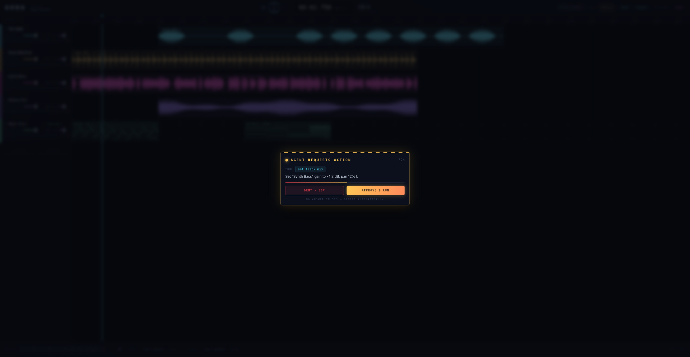

### Export

Offline bounce (faster than realtime) to WAV natively, or mp3/flac/ogg/m4a
through ffmpeg — full song or loop region, with sample-rate, bit-depth, master
gain and tail options:

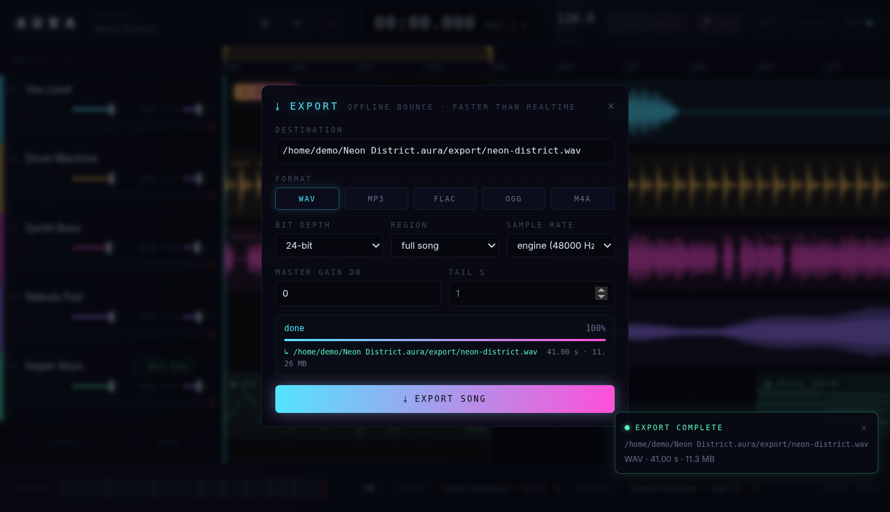

### Themes and accessibility

Full tokenised styling with **eight built-in themes** (AURA Dark, AURA Light,
WCAG AAA High Contrast Dark/Light, Solarized Dark/Light, Nord, Gruvbox Dark)
and **user JSON themes** loaded from disk. All surfaces, borders, glow effects,
and canvas renderings (timeline, piano roll, meters) update instantaneously.
Custom themes can be exported directly from preferences with one click.
See [docs/themes.md](docs/themes.md).

---

## Quickstart

Prerequisites:

- **Rust** (stable toolchain, via [rustup](https://rustup.rs))
- **Node.js 18+** and npm
- **Linux system packages** (for building Tauri):

  ```sh
  sudo apt install libasound2-dev libwebkit2gtk-4.1-dev libjavascriptcoregtk-4.1-dev \
    libsoup-3.0-dev build-essential curl wget file libxdo-dev libssl-dev \
    libayatana-appindicator3-dev librsvg2-dev
  ```

  (`libjavascriptcoregtk-4.1-dev` and `libsoup-3.0-dev` come in as dependencies
  of `libwebkit2gtk-4.1-dev` on Ubuntu 24.04, but are listed explicitly — the
  build needs their `.pc` files, and not every derivative pulls them in.)

- **liblilv-dev** — required to build the LV2 plugin host (`livi` links system lilv):

  ```sh
  sudo apt install liblilv-dev
  ```

- **ffmpeg** — compressed-format import (mp3/ogg/aac/m4a…) and export
  (mp3/flac/ogg/m4a). WAV import/export works without it.

  ```sh
  sudo apt install ffmpeg
  ```

- **Optional — instruments to actually play** (and to un-skip the gated plugin
  tests; each test skips cleanly when its plugin is absent):
  - `sudo apt install zynaddsubfx-lv2` — the ZynAddSubFX instrument (LV2
    acceptance + state round-trip tests)
  - `sudo apt install dpf-plugins-clap dpf-plugins-lv2` — small open-source
    test instruments/effects (CLAP lifecycle tests)
  - `sudo apt install mda-lv2` — mda EPiano etc. (LV2 param tests)
  - more options in [docs/synth-compatibility.md](docs/synth-compatibility.md)

Run it:

```sh
npm install
npm run tauri dev      # or: npx tauri dev
```

Pure-browser demo mode (no Rust build — a mock engine demos every feature in
the browser, which is also where most of this page's screenshots come from):

```sh
npx vite
```

Note: the vite dev server uses port **1420** (`vite.config.ts`, `strictPort`).
If 1420 is taken, run on another port without editing anything:

```sh
npx tauri dev --config '{"build":{"devUrl":"http://localhost:1430","beforeDevCommand":"npm run dev -- --port 1430 --strictPort"}}'
```

**No models? No GPU?** Set `AURA_SIDECAR_SIMULATE=1` and every AI worker
(generation, infilling, instrument building included) produces deterministic
placeholder output — the whole generate → import → hear-it loop works with zero
model stacks.

### Troubleshooting (Linux/GPU): white flash / webview reload under load

When the GPU that drives your desktop is saturated (e.g. ACE-Step generating),
WebKitGTK's DMA-BUF renderer can white-flash or reload the AURA webview
mid-session. AURA works around this at startup by setting
`WEBKIT_DISABLE_DMABUF_RENDERER=1` (the accepted Tauri workaround,
[tauri#9304](https://github.com/tauri-apps/tauri/issues/9304)) — unless you
have already set that variable yourself, which always wins. To opt back into
WebKit's default renderer: `export WEBKIT_DISABLE_DMABUF_RENDERER=0`.

---

## AI features — real-model setup

Every AI feature runs as a Python sidecar process. The stack below is the one
the env-gated integration tests were verified against (real Demucs and real
ACE-Step output through the app's own job pipeline).

Create a venv **at the repo root, named `.venv-sidecars`** (the hum-to-song
feature looks for exactly this path; everything else finds it via `PATH`):

```sh
uv venv .venv-sidecars --python 3.12
source .venv-sidecars/bin/activate

# Stem separation
uv pip install demucs

# ACE-Step music generation — pin torch to the cu126 wheels first
uv pip install torch torchaudio --index-url https://download.pytorch.org/whl/cu126
uv pip install git+https://github.com/ace-step/ACE-Step.git

# AMT MIDI infilling (CPU works)
uv pip install git+https://github.com/jthickstun/anticipation.git mido transformers

# Hum-to-song pitch tracking (optional — degrades to a pure-Python tracker without it)
uv pip install librosa
```

**How the app finds this Python** (mechanism, verified in
`src-tauri/src/sidecars/jobs.rs` and `src-tauri/src/control/hum.rs`):

- The sidecar job runner spawns the **first `python3`/`python` on `PATH`** —
  so launch the app with the venv prepended:

  ```sh
  PATH="$PWD/.venv-sidecars/bin:$PATH" npm run tauri dev
  ```

- The hum-to-song sidecar additionally prefers `<repo>/.venv-sidecars/bin/python`
  automatically when it exists, PATH or not.

On smaller GPUs, ACE-Step's 3.5B pipeline fits in about 7 GB VRAM with
sequential offload:

```sh
export ACESTEP_CPU_OFFLOAD=1
export ACESTEP_OVERLAPPED_DECODE=1
```

The rest of the roster:

- **Transcription** — `whisper-cli` (whisper.cpp) on your `PATH` plus a GGML
  model (`WHISPER_CPP_BIN` / `WHISPER_MODEL_DIR` to point elsewhere).
- **ElevenLabs Music** (cloud) — `export ELEVENLABS_API_KEY=...`; no local model.
- **Stable Audio Open instrument builder** — `uv pip install stable-audio-tools`;
  the model `stabilityai/stable-audio-open-small` is **license-gated on Hugging
  Face**: you must accept its terms with a logged-in HF account before the
  worker can download it. We have not run this model for real for that reason —
  the pipeline is verified in simulate mode only.

Honest status summary: **Demucs and ACE-Step (generate / repaint /
audio2audio) and AMT infilling are verified with real models on real hardware;
Stable Audio Open and ElevenLabs are integrated but were exercised in
simulate/mock mode.**

<details>
<summary>All sidecar environment variables</summary>

| Variable                  | Effect                                                        |
| ------------------------- | ------------------------------------------------------------- |
| `AURA_SIDECAR_DIR`        | Directory containing the sidecar scripts (default: `sidecars/`) |
| `AURA_SIDECAR_MAX_JOBS`   | Max concurrent sidecar jobs (excess jobs queue)               |
| `AURA_SIDECAR_SIMULATE`   | `1` = force simulate mode for ALL workers: deterministic placeholder output, no model stacks needed |
| `WHISPER_CPP_BIN`         | Path to the whisper.cpp binary (default: `whisper-cli` on `PATH`) |
| `WHISPER_MODEL_DIR`       | Directory searched for GGML Whisper models                    |
| `ELEVENLABS_API_KEY`      | ElevenLabs Music API key (required for real `elevenLabsMusic` runs; never logged) |
| `ELEVENLABS_BASE_URL`     | Override the ElevenLabs API base URL (testing)                |
| `ACESTEP_CHECKPOINT_DIR`  | Existing ACE-Step checkpoint directory (skips first-use download) |
| `ACESTEP_DTYPE`           | ACE-Step inference dtype (default `bfloat16`)                 |
| `ACESTEP_INFER_STEPS`     | ACE-Step diffusion step count override                        |
| `ACESTEP_CPU_OFFLOAD`     | `1` = sequential CPU offload (fits ~7 GB VRAM)                |
| `ACESTEP_OVERLAPPED_DECODE` | `1` = overlapped decode (pairs with CPU offload)            |
| `AURA_AMT_MODEL`          | Hugging Face model id for AMT infilling (default `stanford-crfm/music-medium-800k`) |

</details>

---

## Drive AURA from Claude (MCP)

AURA embeds an MCP streamable-HTTP server at `http://127.0.0.1:41717/mcp`
(loopback only). A fresh bearer token is generated per launch and written to
`~/.local/share/aura/mcp-token` (0600). Connect Claude Code:

```sh
claude mcp add --transport http aura http://127.0.0.1:41717/mcp \
  --header "Authorization: Bearer $(cat ~/.local/share/aura/mcp-token)"
```

Tools: read-only (`get_project_state`, `read_meters` — the agent's "ears",
`get_job_status`) plus policy-gated destructive tools (`create_project`,
`add_track`, `set_track_mix`, `transport_control`, `record_take`,
`import_audio_clip`, `run_sidecar_job` for the generation kinds). The default
policy is **confirm-in-UI for every destructive call**; `readOnly` and `full`
modes plus per-tool overrides are available.

Claude Desktop config, the tool contract, auto-import parameters, and the
security model (constant-time token compare, Origin validation, DNS-rebinding
defense) are in **[docs/mcp-usage.md](docs/mcp-usage.md)**.

---

## Synth compatibility

The compatibility sweep drove every straightforwardly installable synth it
could find through the same acceptance harness that gates ZynAddSubFX
(instantiate → note → headless render → non-silence/pitch assert).
Full details, versions and verdicts: **[docs/synth-compatibility.md](docs/synth-compatibility.md)**.

| Synth | Format | Verdict |
|---|---|---|
| ZynAddSubFX | LV2 | **Stable in-process** — pitched-render acceptance gate, patch banks, state round-trip |
| mda EPiano | LV2 | **Stable in-process** |
| synthv1 | LV2 | **Stable in-process** — pitched render |
| geonkick | LV2 | **Stable in-process** (needs ~1.5 s async warm-up) |
| Surge XT | CLAP | Renders audio; stable in the isolated probe |
| padthv1 | LV2 | Renders in isolation only — heap corruption when co-hosted (needs process isolation, D-11) |
| Yoshimi | LV2 | Renders in isolation only — intermittent SIGSEGV co-hosted (D-11) |
| Cardinal (Synth) | CLAP | Hosts cleanly, renders silence headlessly (installed without its resource dir) |
| amsynth / sfizz | — | Untestable on Ubuntu 24.04 (no LV2/CLAP build / not packaged) |

**Score: 6 of 8 testable synths render audio through AURA's hosts.** The
co-hosting crashes are exactly the empirical case for out-of-process plugin
hosting (see roadmap).

---

## Tests

```sh
cd src-tauri && cargo test    # 1252 tests (1216 lib + 36 integration, plus 2 #[ignore]d long-running plugin repros; counted 2026-08-17 after the Composer, Plan H1): engine, MIDI, sampler, plugins, MCP, sidecars, control plane, op log (history + journal), Gate E invariants, library scan/audition, group drag/resize, cross-instance clipboard, clip delete, modulation graph, Plan F history store + placement offsets, gesture tokens, MIDI launch map, pitch scoring + stored pitch curve, lane rename/group/reorder, music theory (spelling/scales/chords/analysis/circle/palette/metre) + the harmony document + the four generators
npm test                      # 778 frontend unit tests (counted 2026-08-17 after the Composer, Plan H1; vitest): stores + timeline math + section-table bijection + library store + automation/modulation edit ops + MIDI I/O + group drag/resize + clip selection/clipboard + frontend clipboard codec/orchestration + MIDI selection export + piano-roll quantize + recent-projects + tempo editor + launch map + pitch wire types + pitch frame bus + pitch lane geometry + pitch panel logic + pitch subscription lifetime + rehearse-hold refcount + pitch report geometry + lane layout/arrange + the composer store + circle geometry + the palette colour ramp
npx svelte-check              # frontend type checking
npm run build                 # production frontend build
```

- **Plugin-gated tests** (Zyn acceptance, CLAP lifecycle, state round-trips)
  run for real when the optional plugins are installed and skip cleanly
  otherwise.
- **Real-model integration tests** (2) drive the actual Demucs and ACE-Step
  models through the app's job pipeline; they skip politely unless enabled:

  ```sh
  AURA_REAL_MODELS=1 \
  AURA_REAL_PYTHON=$PWD/.venv-sidecars/bin/python \
      cargo test --test real_models -- --nocapture
  ```

---

## Repository layout

| Path                      | Contents                                              |
| ------------------------- | ----------------------------------------------------- |
| `src/`                    | Svelte 5 frontend (components, state, canvas render)  |
| `src/lib/tauri.ts`        | Typed IPC bridge to the Rust backend                  |
| `src-tauri/src/audio/`    | Audio engine: transport, mixer, recorder, meters, waveform, project persistence, SFZ sampler |
| `src-tauri/src/control/`  | Shared control plane — the one seam Tauri commands AND MCP tools drive (import, export, hum, loop-jam) |
| `src-tauri/src/midi/`     | Tick timeline, tempo map, MIDI clips/synth, .mid interop, AMT infill |
| `src-tauri/src/plugins/`  | CLAP/LV2 hosting: shared plugin main thread, crash-isolated scan, patches, state persistence, automation groundwork |
| `src-tauri/src/mcp/`      | Embedded MCP server: tools, policy, auth, HTTP layer  |
| `src-tauri/src/sidecars/` | Sidecar job runner (spawn, queue, cancel, NDJSON protocol) |
| `sidecars/`               | Python sidecars: Demucs, Whisper, ACE-Step, ElevenLabs, AMT, Stable Audio SFZ, hum-to-MIDI |
| `docs/`                   | Architecture & scaling docs, IPC schemas, MCP usage — see [docs/README.md](docs/README.md) |

---

## Roadmap

The near-term list, distilled from the [SCALABILITY debt register](docs/SCALABILITY.md):

- **Out-of-process plugin hosting** (D-11, the open half) — scanning already
  runs in a sacrificial subprocess; runtime DSP isolation behind the
  `LiveNodeCell` seam is what unlocks padthv1/Yoshimi-class plugins.
- **Undo/redo** — via the op-log protocol (D-03), not ad hoc; `set_track_mix`
  already ships batch-shaped as its first step.
- **Automation UI** — lanes and the sample-accurate ramp seam are in the
  engine; drawing/editing UI is not built yet.
- **Plugin GUI windows** — v1 = plugin-owned/floating windows alongside the
  generic param panel.
- **Plugin delay compensation (PDC)** — in the graph compiler, before
  sends/sidechains ship.
- **VST3** — later, behind the same internal plugin contract.

## License

[GPL-3.0](LICENSE).

## Should this exist?

Honest question, honestly meant. LMMS, Ardour and Zrythm exist and have real
communities. Is "schema-driven core + local AI pipeline + MCP-native agent
control" a genuine architectural reason for a new DAW — or should this energy
flow into an existing one? If you have an opinion either way,
[open an issue](https://github.com/knobo/aura-daw/issues). Blunt answers
welcome; the engine code appreciates skeptical eyes most of all.
